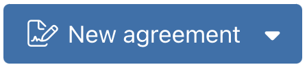
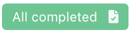

# Colors

## Blue
<color-swatch color="#2d71ad" width=50 />
- Harbour blue
- Blue means actionable
- Buttons, Submit, CTAs
- Headings

## Black
<color-swatch color="#333" width=50 />
- For copy, headings

## White
<color-swatch color="#fff" width=50 />
- Background
- Black copy over this
- Button copy

## Green
<color-swatch color="#48c78e" width=50 />
- Means success
- Checkmarks

## Grey
<color-swatch color="#b7b7b7" width=50 />

- Clickable items (not CTAs)
- Options, hovered background

