# Colors

## Blue
<color-swatch color="#2d71ad" width=50 />
- Harbour blue
- Blue means actionable
- Buttons, Submit, CTAs
- Headings

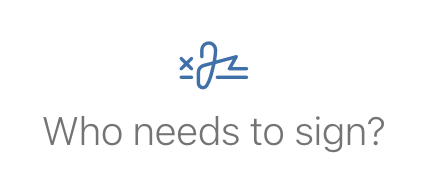

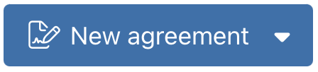

## Black
<color-swatch color="#333" width=50 />
- For copy, headings

## White
<color-swatch color="#fff" width=50 />
- Background
- Black copy over this
- Button copy

## Green
<color-swatch color="#48c78e" width=50 />
- Means success
- Checkmarks

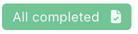

## Grey
<color-swatch color="#b7b7b7" width=50 />

- Clickable items (not CTAs)
- Options, hovered background

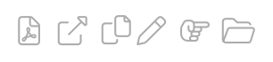

# Iconography

## Font Awesome Icons
Harbour uses font awesome icons. They're descriptive and they pop.

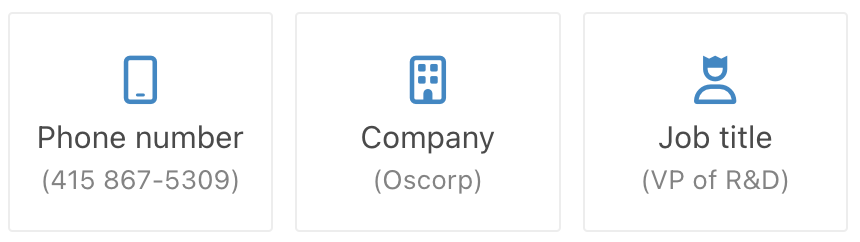
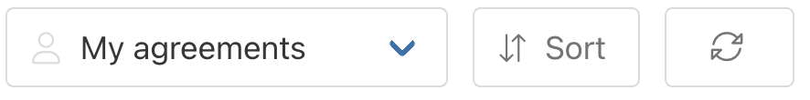

# Typography

## SF Pro
Used as the apple system font, SF Pro is used for body copy, titles, and headings.

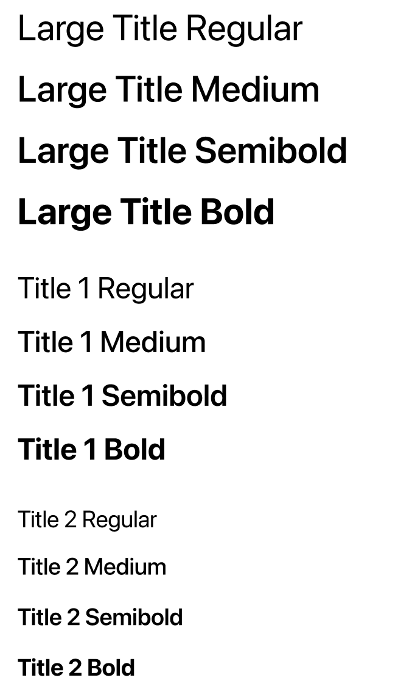
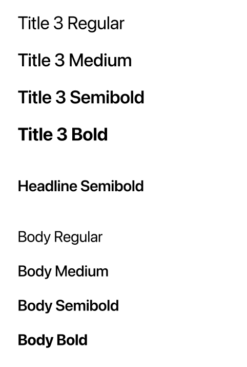 
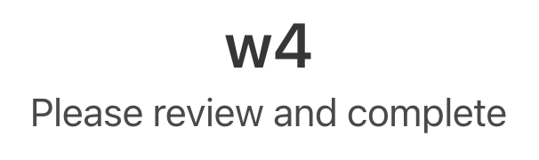
<!-- 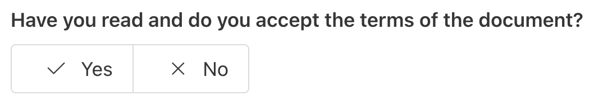 -->
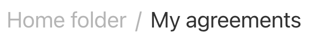

# Elements

## Checkmarks
- Harbour likes checkmarks
- Success, yes, active

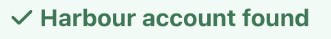

## Maps
- Sense of place
- Descriptive like our icons
- International

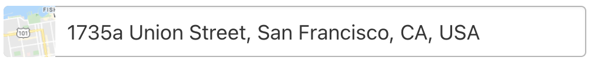
